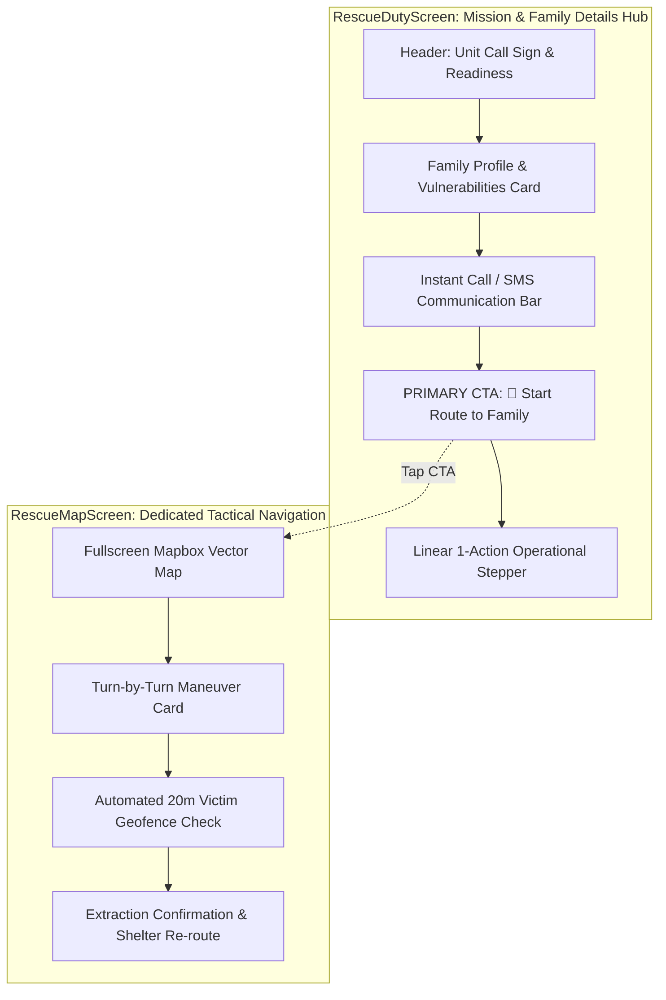

# Rescue Mobile Unit UI/UX Architectural Specification

> **Document Version:** 1.0.0  
> **Status:** Approved for Implementation  
> **Target Platform:** React Native / Expo (`frontend/Evac_RouteMobile`)  
> **Affected Screens:** `RescueDutyScreen.jsx`, `RescueMapScreen.jsx`

---

## 1. Executive Summary & Design Rationale

In search-and-rescue disaster operations, field responders operate under high physical stress, adverse weather (heavy rain, floodwaters), with protective gear (gloves, wet screens), and often one-handed.

The previous rescue UI suffered from two critical usability anti-patterns:
1. **Redundant Map Rendering & GPU Drain:** An embedded Mapbox component was loaded inside `RescueDutyScreen` alongside a separate, dedicated `RescueMapScreen`. This led to double memory allocation, slow render times on mobile devices, and high battery consumption.
2. **Button Proliferation & Choice Paralysis:** Up to 9 competing buttons (multiple "Navigate" buttons, Google Maps links, and multi-state stepper buttons) were displayed simultaneously, pushing vital family distress details below the fold.

### Core Architectural Decision: Complete Separation of Concerns

---

## 2. Screen 1: `RescueDutyScreen` Specification

`RescueDutyScreen` serves as the **Command & Family Details Hub**. It contains **no embedded map**, guaranteeing instantaneous screen loading and zero layout shifts.

### 2.1 Information Hierarchy (Top to Bottom)

1. **Header & Readiness Bar:**
   - Rescuer Name & Assigned Fleet Craft (`QRT DELTA-3 • Boat Pilot`).
   - Readiness toggle (`🟢 Ready for Dispatch` / `🟡 Standby / Refueling`).
   - Active sector hazards indicator count.

2. **Hero Mission & Family Card (Above the Fold):**
   - **Triage Level Banner:** High-contrast indicator (`CRITICAL` Red or `URGENT` Amber) with official mission control number (`RES-XXXXXX`).
   - **Family Headcount & Names:** Prominently formatted (e.g., `Santos Family (4 Persons)`).
   - **Vulnerability Tags:** Automated detection badges highlighting vulnerable evacuees:
     - `🧓 Elderly`
     - `👶 Infant / Child`
     - `♿ Mobility / PWD`
     - `🤰 Pregnant`
     - `🏠 Rooftop Trapped`
   - **Location Metadata:** Barangay name, street landmark, and GPS coordinates.
   - **Situation Report Quote:** Exact citizen distress notes enclosed in a clean quote box.

3. **Fast Communications Bar:**
   - Two equal-width, high-touch buttons:
     - `[ 📞 Call Family ]` — Triggers native phone dialer.
     - `[ 💬 Quick SMS Alert ]` — Pre-fills a standardized CDRRMO emergency reassurance SMS with rescuer call sign.

4. **Primary Tactical Navigation CTA (Hero Action):**
   - Full-width, 54px minimum height button with contrasting vibrant background:
   - When en route: `[ 🧭 START ROUTE TO FAMILY LOCATION (MAP) ]`
   - When transporting: `[ 🏢 START ROUTE TO EVACUATION SHELTER ]`
   - Tapping transitions immediately to `RescueMapScreen`.

5. **Assigned Drop-off Shelter Card:**
   - Name of designated evacuation shelter (`Tetuan Covered Court` or `Baliwasan Gym`).
   - Facility type and automated CSWDO intake status note.

6. **Linear Single-Action Operational Stepper:**
   - Instead of showing multiple action buttons simultaneously, **only the NEXT valid state transition button is rendered**:
     - State `dispatched`: `[ 1. ACCEPT & EN ROUTE ]`
     - State `en_route`: `[ 2. CONFIRM ARRIVED ON SCENE ]`
     - State `on_scene`: `[ 3. START TRANSPORT TO SHELTER ]` & optional `[ 🌊 UNLOAD AT STAGING POINT ]`
     - State `transporting`: `[ 4. INTAKE HANDOVER & COMPLETE ]`

---

## 3. Screen 2: `RescueMapScreen` Specification

`RescueMapScreen` serves as the **Dedicated Tactical Navigation HUD**. It takes over the full viewport for turn-by-turn routing and spatial orientation.

### 3.1 Key Features

1. **Fullscreen Vector Map:**
   - Mapbox MapView anchored to Zamboanga City coordinates.
   - Rescuer Live Pin (🚤 Boat / 🛻 Truck) with heading indicator.
   - Victim Distress Pin (🚨 SOS) and Target Shelter Pin (🏢 Building).
   - High-contrast polyline (Glowing orange for extraction phase, vibrant cyan for shelter transport phase).

2. **Top Navigation HUD:**
   - Maneuver direction icon (↰ Left, ↱ Right, ↑ Straight, 🏁 Arrive).
   - Distance to next maneuver (e.g., `IN 150 METERS`).
   - Instruction text (e.g., `Turn left onto Gov. Camins Avenue`).
   - Distance and ETA pill to target destination.
   - Quick Back button returning to `RescueDutyScreen`.

3. **Automated 20-Meter Proximity Geofencing:**
   - Uses real-time Haversine distance from live GPS coordinates (`Location.watchPositionAsync`).
   - When rescuer GPS is $\le 20\text{ meters}$ from victim:
     - Triggers haptic vibration pattern (`[0, 200, 100, 300]`).
     - Automatically prompts arrival modal: *"You have arrived at the victim's location."*
     - Advances mission status to `on_scene` on backend.
   - When rescuer GPS is $\le 20\text{ meters}$ from shelter:
     - Prompts CSWDO Intake Handover confirmation.

4. **Automated Re-Routing on Extraction:**
   - When status transitions from `on_scene` to `transporting`:
     - Mapbox navigation instantly re-calculates the polyline from rescuer's current position to the designated shelter.
     - HUD updates destination title to shelter name.

5. **Discrete Presentation Controls:**
   - Simulation triggers (`Sim: 20m to Victim`, `Sim: 20m to Shelter`) are isolated inside a collapsible developer drawer (`⚡ Demo Controls`), ensuring real field rescuers operate strictly with live GPS.

---

## 4. UI/UX Design Standards Checklist

| Heuristic / Standard | Implementation in Redesign |
| :--- | :--- |
| **Cognitive Load** | Reduced from 9 competing buttons to 1 prominent Navigation CTA + 1 Stepper Action. |
| **Touch Target Size** | All primary action buttons maintain $\ge 50\text{px}$ touch targets for wet/gloved hands. |
| **WCAG 2.1 AA Contrast** | High-contrast `#ffffff` and `#38bdf8` text on `#0f172a` deep slate background ($\ge 7:1$ contrast ratio). |
| **Reading Flow** | Strict F-pattern: Priority $\rightarrow$ Family $\rightarrow$ Vulnerabilities $\rightarrow$ CTA. |
| **Performance** | Zero duplicate Mapbox instantiations; `RescueDutyScreen` runs lightweight pure React Native views. |

---

## 5. Implementation Roadmap

1. **Phase 1: `RescueDutyScreen.jsx` Refactor:**
   - Remove `<TacticalRescueMap />` component import and usage.
   - Redesign Family Card with enhanced vulnerability badges and situation text.
   - Add hero `[ 🧭 START ROUTE TO FAMILY LOCATION ]` button.
   - Refactor Stepper to strictly render one primary button corresponding to current status.

2. **Phase 2: `RescueMapScreen.jsx` Streamlining:**
   - Retain full-screen Mapbox router and HUD telemetry.
   - Clean up bottom dock actions so they do not duplicate Duty Screen features.
   - Ensure back button cleanly routes to `RescueDutyScreen`.

3. **Phase 3: Verification & Smoke Testing:**
   - Execute mobile ESLint check (`npm run lint`).
   - Run end-to-end mission verification (`node scripts/verify_mobile_ui_flows.mjs`).
   - Run Hermes bundle export (`npx expo export --platform android`).
